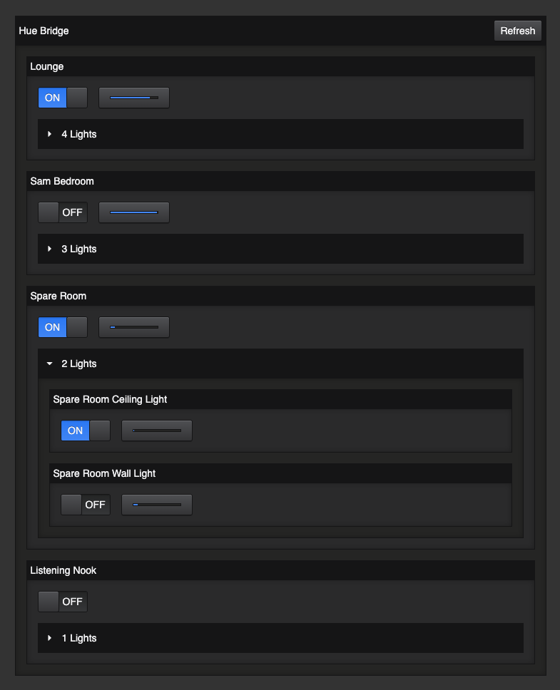

# Example Philips Hue App using `@arcanejs/react-toolkit`

This repository is an example Node.js app that uses
[`@arcanejs`](https://github.com/arcanejs/arcanejs)
to create a minimal Philips Hue Controller App.

More concretely, the following libraries are used:

- [`node-hue-api`](https://github.com/peter-murray/node-hue-api)
  to interact with a local hue bridge
- [`zod`](https://github.com/colinhacks/zod)
  to define the data that needs to be stored by the application
- [`@arcanejs/react-toolkit`](https://github.com/arcanejs/arcanejs/blob/main/packages/react-toolkit/README.md)
  to:
  - build controller UIs
  - manage application state & storage using local JSON files and `zod`.
  - manage server-side application state using `react`.

You're welcome to take this example repository as a starting-point / template
for your own projects.

## Usage

Use `pnpm` to install dependencies, then simply run `start`:

```
pnpm install && pnpm start
```

### Screenshot


